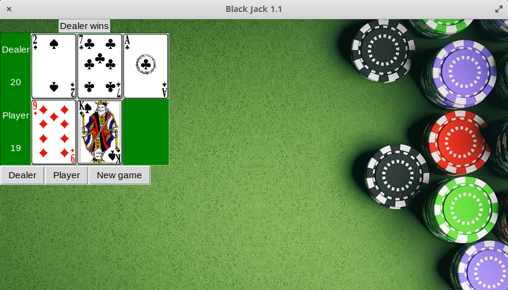
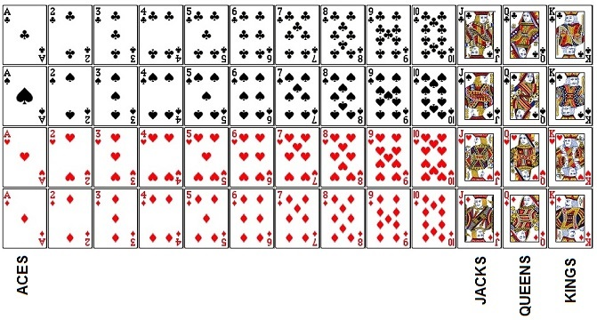

<h1>Black-Jack-Game</h1>

Real Life Rummy Game in Python

<h2>Output Images:</h2>

<h2>How to Play:</h2>
<ol>
  <li>The game is played with a standard deck of 52 cards (no jokers).</li>
  <li>The goal is to beat the dealer by having a hand value greater than the dealer's hand value without exceeding 21.</li>
  <li>The game begins with the dealer giving each player and themselves two cards.</li>
  <li>Each card is assigned a point value: numbered cards are worth their face value, face cards (kings, queens, and jacks) are worth 10 points, and aces are worth 1 or 11 points.</li>
  <li>The player can "hit" to request an additional card from the dealer, or "stand" to keep their current hand and end their turn.</li>
  <li>The dealer must hit until their hand value is 17 or greater.</li>
  <li>If the player's hand value exceeds 21, they "bust" and lose the game.</li>
  <li>If the dealer busts, the player wins the game.</li>
  <li>If the player's hand value is greater than the dealer's hand value without exceeding 21, the player wins the game.</li>
  <li>If the dealer's hand value is greater than the player's hand value without exceeding 21, the dealer wins the game.</li>
  <li>If both the player and the dealer have the same hand value, the game is a tie or "push".</li>
</ol>
<h2>Dependencies:</h2>
<ul>
  <li>Python 3.x</li>
  <li>random module</li>
  <li>time module</li>
</ul>
<h2>How to Run:</h2>

Simply run the python script:

<code>python blackjack.py</code>
